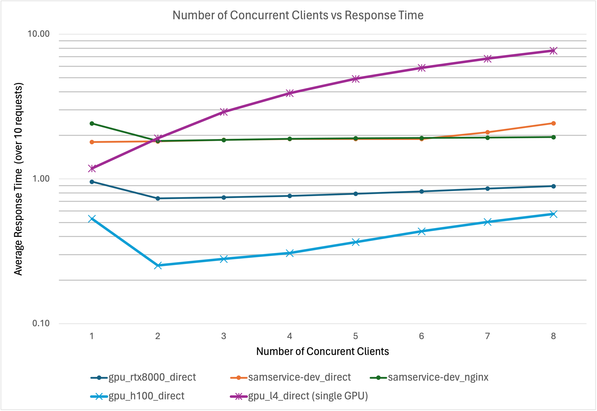

# Benchmarks



Note the logarithmic Y axis. 

In the single worker case, these are the average response times to encode the [test image](../em1.png):

| System | GPUs | Average response time (s) | 
|--------|------|---------------------------|
| samservice-dev server | 8x Quadro M6000 | 1.7996278 |
| gpu_l4 queue on Janelia cluster | L4 | 1.1836759 |
| gpu_rtx8000 queue on Janelia cluster | RTX8000 | 0.9582537 | 
| gpu_h100 queue on Janelia cluster | H100 | 0.5316413000000001 |

## Methodology

The benchmarks were run on a separate host from the service using the test script:
```
for W in {1..8}; do python tests/test_load.py -u http://server:8000 -i tests/em1.png -w $W -r 10; done >> gpu_rtx8000_direct.txt
```
This spins up `-w` workers and each set of workers submits `-r` requests in sequence. 
